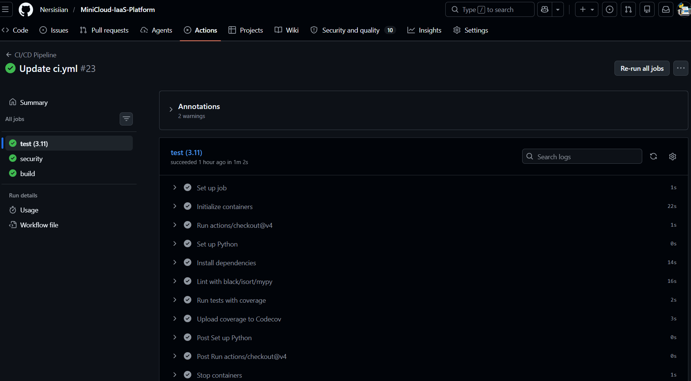
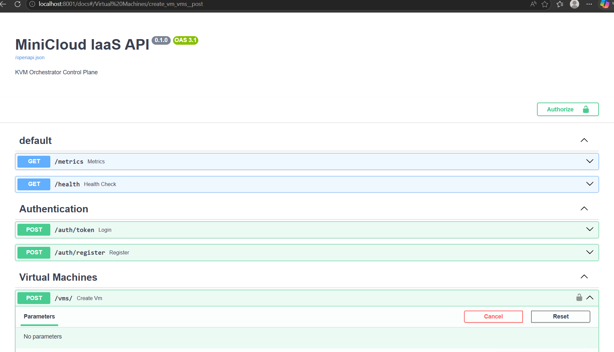
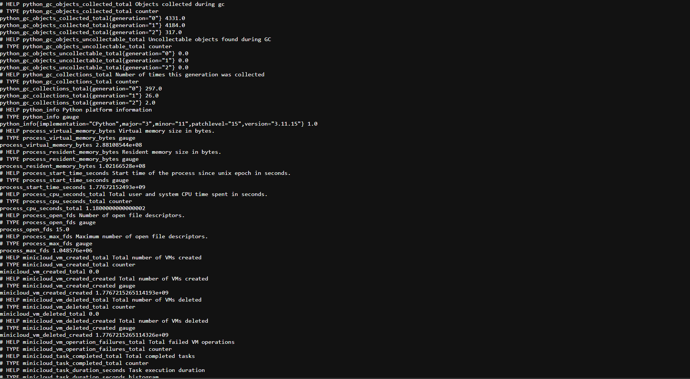
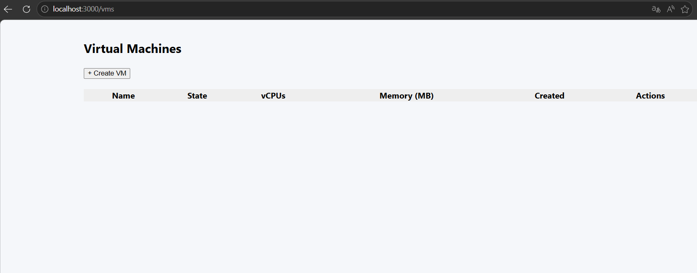

# 🚀 MiniCloud IaaS Platform

**Production‑grade KVM orchestration system – a simplified OpenStack Nova alternative.**

[](https://github.com/Nersisiian/Minicloud/actions/workflows/ci.yml)
[](LICENSE)
[](https://python.org)
[](https://fastapi.tiangolo.com)
[](https://docker.com)

MiniCloud is a scalable Infrastructure‑as‑a‑Service control plane that manages KVM virtual machines. It provides a secure REST API, asynchronous task processing with Celery, and persistent state in PostgreSQL. The architecture is designed for clarity, extensibility, and production readiness.

---
## 📸 Visual Overview

| CI/CD Pipeline | API Documentation |
|:---:|:---:|
|  |  |

| VM Creation | Prometheus Metrics |
|:---:|:---:|
|  |  |

| Web UI Dashboard |
|:---:|
|  |

---

## 📖 Table of Contents

- [Features](#-features)
- [Architecture](#-architecture)
- [Quick Start](#-quick-start)
- [API Endpoints](#-api-endpoints)
- [Observability](#-observability)
- [Development](#-development)
- [Configuration](#-configuration)
- [Project Structure](#-project-structure)
- [Roadmap](#-roadmap)
- [License](#-license)

---

## ✨ Features

- **VM Lifecycle Management** – Create, delete, clone, pause, resume virtual machines.
- **Multi‑Tenant** – Users see only their own resources (JWT authentication).
- **Asynchronous Operations** – Non‑blocking API with Celery + Redis.
- **Observability** – Structured JSON logs and Prometheus metrics endpoint.
- **Idempotent & Fault‑Tolerant** – Tasks are retried automatically on failure.
- **KVM Integration** – Uses libvirt for direct hypervisor control.
- **Production Ready** – Docker Compose setup with Nginx reverse proxy.
- **Web UI** – React + TypeScript dashboard for managing VMs.

---

## 🏗️ Architecture
┌─────────────┐ ┌─────────────┐ ┌─────────────┐
│ Client │────▶│ Nginx │────▶│ FastAPI │
│ (HTTP/S) │ │ (Proxy) │ │ (API) │
└─────────────┘ └─────────────┘ └──────┬──────┘
│
┌────────▼────────┐
│ PostgreSQL │
│ (DB) │
└─────────────────┘
▲
┌────────┴────────┐
│ Redis │
│ (Broker) │
└────────┬────────┘
│
┌────────▼────────┐
│ Celery Worker │
│ (libvirt) │
└────────┬────────┘
│
┌────────▼────────┐
│ KVM/QEMU │
│ Hypervisor │
└─────────────────┘


### Component Details

| Component         | Technology                        | Responsibility                           |
|-------------------|-----------------------------------|------------------------------------------|
| API Layer         | FastAPI (async) + Pydantic        | REST endpoints, authentication, validation |
| Orchestrator      | Python service                    | Business logic, task creation            |
| Task Queue        | Celery + Redis                    | Asynchronous VM operations               |
| KVM Integration   | libvirt‑python + QEMU             | Hypervisor control (define, start, stop) |
| Database          | PostgreSQL + SQLAlchemy (async)   | Persistent state storage                 |
| Reverse Proxy     | Nginx                             | Load balancing, SSL termination          |
| Observability     | Prometheus client + JSON logging  | Metrics and structured logs              |
| Web UI            | React + TypeScript + Vite         | User dashboard for VM management         |

---

## 🚀 Quick Start

### Prerequisites

- **Docker** and **Docker Compose** (v2.0+)
- **KVM** enabled on the host (for the worker container)
- A base VM image (qcow2 format) – see [Preparing a Base Image](#preparing-a-base-image)

### 1. Clone the Repository

```bash
git clone https://github.com/Nersisiian/Minicloud.git
cd Minicloud
```
2. Configure Environment
```
 cp .env.example .env
# Edit .env and set a strong SECRET_KEY
```
3. Start the Stack
```
docker-compose up -d
````````````````
The API will be available at http://localhost (port 80) via Nginx.
`
4. Create a User and Obtain a Token
```
# Register a new user
curl -X POST http://localhost/auth/register \
  -H "Content-Type: application/json" \
  -d '{"username":"admin","password":"admin","email":"admin@example.com"}'

# Login to get JWT token
curl -X POST http://localhost/auth/token \
  -H "Content-Type: application/x-www-form-urlencoded" \
  -d "username=admin&password=admin"
```
5. Create Your First VM
```
export TOKEN="<your_access_token>"

curl -X POST http://localhost/vms/ \
  -H "Authorization: Bearer $TOKEN" \
  -H "Content-Type: application/json" \
  -d '{
    "name": "my-first-vm",
    "vcpus": 2,
    "memory_mb": 2048,
    "disk_gb": 20,
    "image_source": "/var/lib/minicloud/images/base-ubuntu-22.04.qcow2"
  }'
```
Check task status: GET /tasks/{task_id}.

📡 API Endpoints
Method	Endpoint	Description
POST	/auth/register	Register a new user
POST	/auth/token	Obtain JWT token
POST	/vms/	Create a new VM (async)
GET	/vms/{id}	Get VM details
DELETE	/vms/{id}	Delete a VM
POST	/vms/{id}/pause	Pause a running VM
POST	/vms/{id}/resume	Resume a paused VM
POST	/vms/{id}/clone	Clone an existing VM
GET	/tasks/{id}	Get task status
GET	/health	Health check
GET	/metrics	Prometheus metrics
Full OpenAPI docs available at http://localhost/docs.
``
📊 Observability
Metrics: Prometheus endpoint exposed at /metrics (scrape it with Prometheus, visualize with Grafana).

Logs: All services output JSON‑formatted logs, easily ingested by ELK, Loki, or Datadog.

Health Checks: /health endpoint for container orchestration.
``
🛠️ Development
Local Setup (Without Docker)
```
# Install Poetry
pip install poetry

# Install dependencies
poetry install

# Apply migrations
alembic upgrade head

# Run API
uvicorn api.main:app --reload

# Run Celery worker (in another terminal)
celery -A workers.celery_app worker --loglevel=info
```
Running Tests
```
pytest tests/ --cov=. --cov-report=term-missing
```
Code Formatting
```
black .
isort .
mypy api core workers libvirt --ignore-missing-imports
```
⚙️ Configuration
All configuration is done via environment variables. See .env.example for all available options.

Variable	Description	Default
SECRET_KEY	JWT signing secret	change-me-in-prod (MUST be changed)
DATABASE_URL	PostgreSQL connection string (asyncpg)	postgresql+asyncpg://...
REDIS_URL	Redis URL for Celery broker/backend	redis://redis:6379/0
LIBVIRT_URI	libvirt connection URI	qemu:///system
VM_IMAGE_DIR	Directory where VM disk images are stored	/var/lib/minicloud/images
VM_BRIDGE_IFACE	Network bridge for VMs	virbr0
LOG_LEVEL	Logging verbosity	INFO
``
📂 Project Structure
---
minicloud/
├── api/                    # FastAPI application
│   ├── routes/             # Route handlers (auth, vms, tasks)
│   ├── dependencies.py     # Auth & DB dependencies
│   └── schemas.py          # Pydantic models
├── core/                   # Business logic & orchestration
│   ├── config.py           # Settings (Pydantic)
│   ├── orchestrator.py     # VM orchestration service
│   ├── security.py         # Password hashing, JWT
│   └── exceptions.py       # Custom exceptions
├── workers/                # Celery worker and tasks
│   ├── celery_app.py       # Celery configuration
│   └── tasks/              # Task definitions
├── libvirt/                # KVM integration layer
│   ├── manager.py          # LibvirtManager class
│   └── templates/          # XML domain templates
├── db/                     # Database models & migrations
│   ├── models/             # SQLAlchemy models
│   └── migrations/         # Alembic migrations
├── observability/          # Logging and metrics
│   ├── logging_config.py
│   └── metrics.py
├── web/                    # React Web UI
│   ├── src/
│   └── package.json
├── docker/                 # Dockerfiles
│   ├── Dockerfile.api
│   ├── Dockerfile.worker
│   └── Dockerfile.nginx
├── scripts/                # Helper scripts
├── docker-compose.yml      # Full stack orchestration
├── pyproject.toml          # Poetry dependencies
├── requirements.txt        # Pip dependencies (CI friendly)
└── README.md               # You are here
``
🗺️ Roadmap
VM snapshot management

VNC/SPICE console access

Networking: VLAN/VXLAN isolation with Open vSwitch

Live migration support

Kubernetes operator for MiniCloud

Enhanced Web UI with real‑time updates
``
📄 License
This project is licensed under the Apache License 2.0 – see the LICENSE file for details.
```
